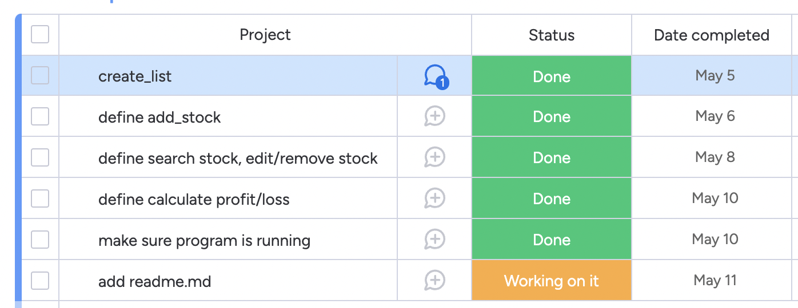
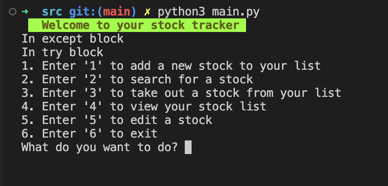
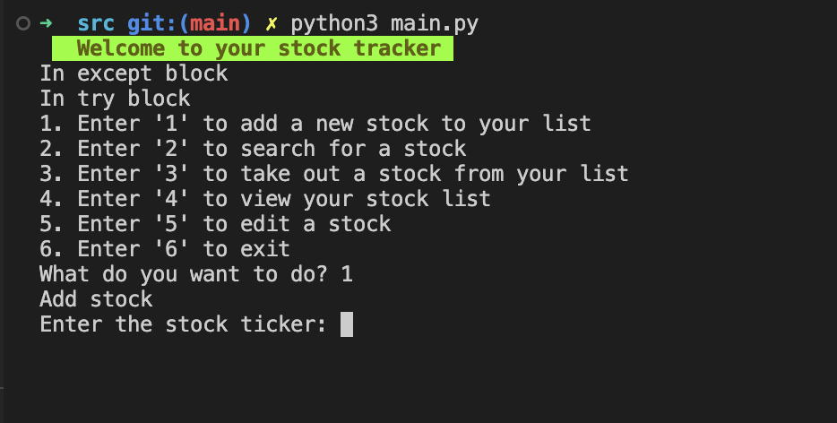
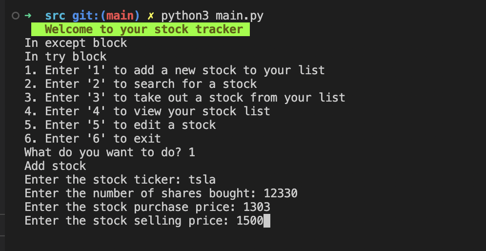
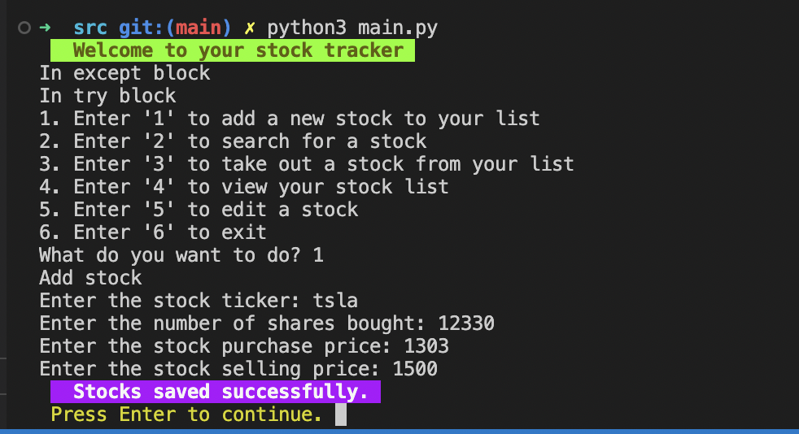
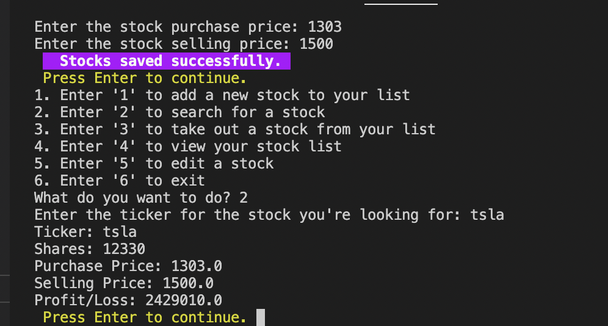
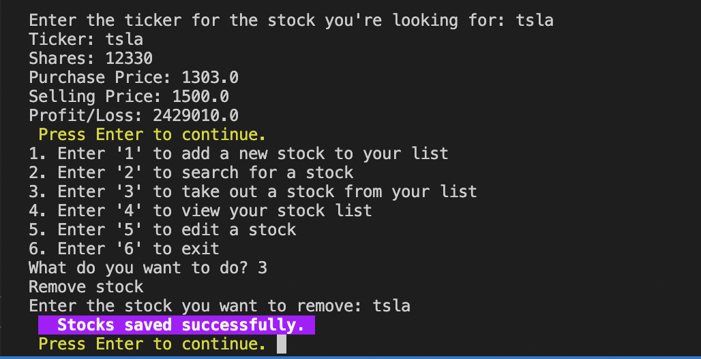
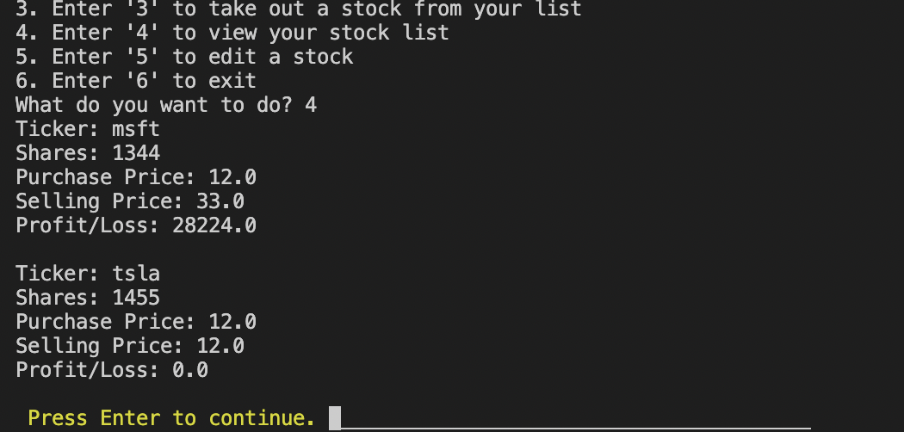
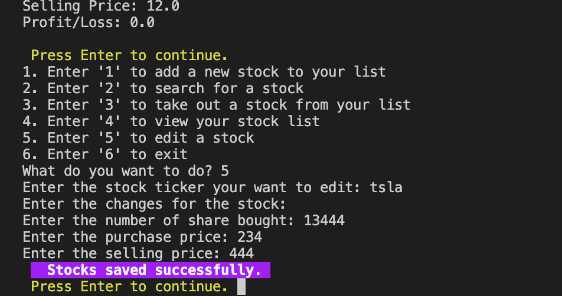

# STOCK TRACKER TERMINAL APPLICATION

### Link to Git Hub
[Click on this link for me Git Hub repo](https://github.com/MeikaPonnan/T1A3)

### Features included in the application:
- Allows user to add stocks and ask users for name of the stock, number of shares bought, buying price and selling price.
- Allows user to search for certain stock with writing the name for the stock, which then display all the info about the stock.
- Allows user to view all stocks in the csv file.
- Allows user to remove and edit stocks.
- Calculates the profit and loss of the stocks which is included when user search for the stock or views all the stock info.

### Planning:
I used monday.com to track my implementation plan.
I worked on each feature until i got the code to run smoothly. This took a while since i got stuck when creating multiple files.
Below is a screenshot of my implementation plan.

### How to install the application:
1. Ensure python3 is installed on the computer/laptop
2. This repo can be forked on GitHub to clone to local computer
3. Run the application by typing 'python3 main.py'
This should prop up:

4. Choose from the options:
        If you want to add a stock press '1' on the keyboard

5. Add the stock details as prompted:

        Once done the data will be saved on stocks.csv

6. Press Enter to continue to use the program and the prompt will show up again. If you want to search for a stock, press '2'. It will output all the data stored for that particular stock entered.

7. To remove a stock from the list, press '3' and you can choose which stock to remove.

8. To view all the stocks saved, press '4', and it outputs all the stocks found in the stocks.csv file

9. You can also edit the stock by pressing '5' and inputing the stock name and the program allows you to edit the data within the stock

10. Finally once you're done using the program you can press '6' to exit.

### Testing:
We can test the program's reading and writing capabilities by testing each functions.
For example we can add stocks with specific inputs and see if the expected output is displayed. We can make sure the profit/loss out is diplayed when view stock or seach stock is requested.
